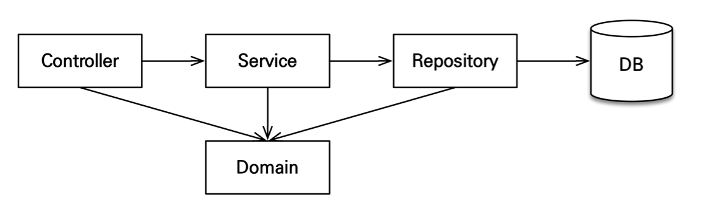
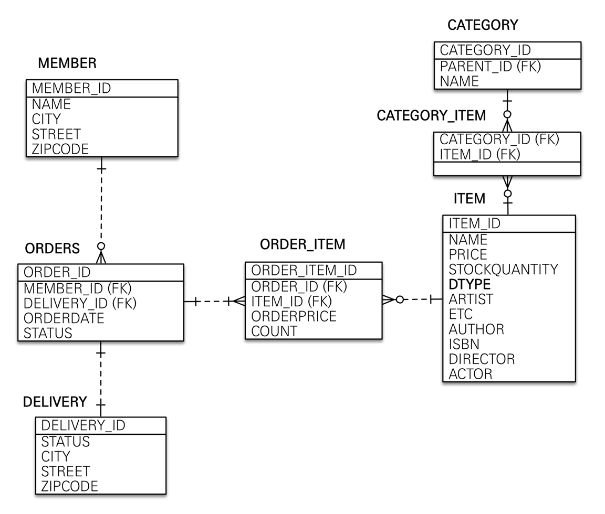

Spring Boot + JPA 연습!
=======================
######인프런 김영한 강사님의 "실전! 스프링 부트와 JPA 활용1" 내용입니다.
> 링크: <https://www.inflearn.com/course/%EC%8A%A4%ED%94%84%EB%A7%81%EB%B6%80%ED%8A%B8-JPA-%ED%99%9C%EC%9A%A9-1#>

***
1. 아키텍처
</img> 

2. ERD
</img> 

3. UI
</img> 

